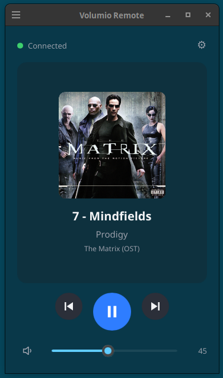
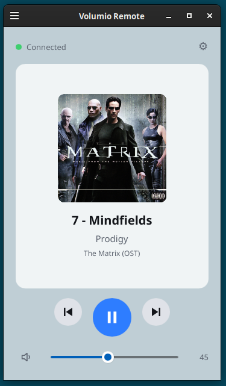
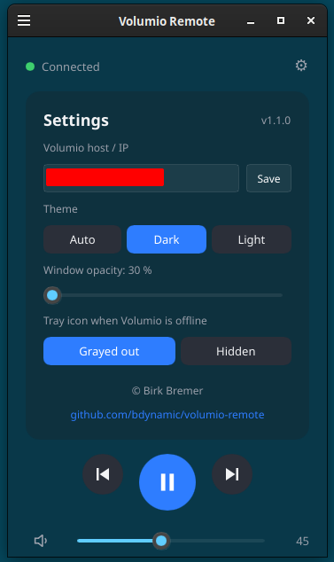

# volumio-remote

Lightweight Linux desktop remote for a [Volumio](https://volumio.com) instance on the local network. Written in Rust with [Slint](https://slint.dev).

## Features

- Now-playing window: cover art with rounded corners, title, artist, album; long texts scroll; click on it opens the Volumio web UI in the browser
- Play/pause, previous/next, mute, volume slider
- Dark and light theme (auto-follows GTK theme), adjustable window opacity
- System tray icon (StatusNotifierItem); grayed out or hidden while Volumio is offline
- MPRIS2 media player: keyboard media keys and `playerctl` control Volumio
- Hardware/keyboard volume knob controls Volumio volume via a virtual audio sink (PulseAudio / PipeWire-pulse)
- CLI flags for desktop shortcuts (`--toggle`, `--next`, `--vol-up`, ...)
- Settings dialog with host, theme, opacity, offline tray behavior, app version, copyright and GitHub link
- Single static-ish binary, no daemon, plain-text config

Target desktop: Cinnamon on X11. Other desktops with StatusNotifierItem and MPRIS support should work.

## Install

Needs Rust ([rustup](https://rustup.rs)), a C toolchain and the build libraries. On Debian/Ubuntu/Mint:

```
sudo apt install build-essential pkg-config libfontconfig1-dev libxkbcommon-dev libxcb1-dev
```

Then:

```
./install.sh            # pull, build release, install to ~/.local/bin, enable autostart, (re)start
./install.sh --no-pull  # skip git pull
./install.sh --no-start # do not start after install
```

The app starts at login. On first start the window opens; enter the Volumio host (e.g. `volumio.local` or `192.168.1.10`) in the settings (gear icon). Log: `~/.cache/volumio-remote.log`.

## Use

| What | How |
|---|---|
| Show window | click tray icon, or tray menu "Show window" |
| Close window | X button hides it, app keeps running; "Quit" in the tray menu ends it |
| Media keys / `playerctl` | work while Volumio is reachable; the player disappears while it is offline |
| Volume knob | tray menu "Use as default output" once; then the keyboard volume keys set the Volumio volume. Needs `pactl` (PulseAudio or PipeWire-pulse) |
| Settings | gear icon: host, theme (Auto/Dark/Light), opacity, tray behavior when offline |

CLI (for shortcuts, e.g. if the knob route is not wanted):

```
volumio-remote --toggle | --next | --prev | --vol-up | --vol-down | --mute
volumio-remote --show            # start with the window open
volumio-remote --diagnose-knob   # debug the volume knob path (sends real volume commands)
```

`VR_DEBUG=1 volumio-remote` logs every knob event.

## Config

`~/.config/volumio-remote/config`, plain `key=value`:

```
host=volumio.local
offline_tray=gray    # gray | hide
theme=auto           # auto | dark | light
opacity=100          # 30..100
```

## Releases

Prebuilt Linux x86_64 binaries are attached to the [GitHub releases](../../releases), built by a workflow that runs manually or when a `v*` tag is pushed (`.github/workflows/release.yml`).

## Development

```
cargo build
cargo test
```

Docs are in [`devdoc/`](devdoc/): [requirements](devdoc/requirements.md), [architecture](devdoc/architecture.md), [build and install](devdoc/build-install.md), [volume knob](devdoc/volume-knob.md), [troubleshooting](devdoc/troubleshooting.md).

## Acknowledgements

Modeled on [majko96/VolumioApp](https://github.com/majko96/VolumioApp). That project has no license; no code was copied.

## License

GPL-3.0-or-later, see [LICENSE](LICENSE). Not affiliated with Volumio.

## Screenshots

| Dark, transparent | Light | Settings |
|---|---|---|
|  |  |  |
